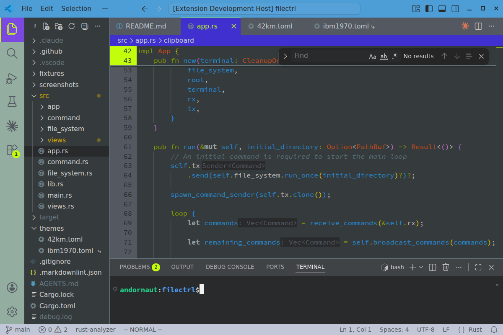
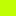

# 42KM theme for Visual Studio Code

A [Marathon](https://marathonthegame.com/) (video game) inspired dark color theme for [Visual Studio Code](https://code.visualstudio.com).

## Installation

1. Install from the [Extension Marketplace](https://marketplace.visualstudio.com/items?itemName=Andornaut.42km-theme)
   * Alternatively, press CTRL+p to open the "Quick Open" menu, and run the following command: `ext install Andornaut.42km-theme`
1. Select: File > Preferences > Themes > Color Theme > 42KM



## Colors

### UI

| Color | Hex | Usage |
| ----- | --- | ----- |
|  Lime Green | `#c0fe04` | Primary accent — cursor, links, active line number, focus border, git modified |
|  Blue-Purple | `#4030d0` | Active tabs, breadcrumb background, editor selection |
|  Purple | `#7c48e2` | Activity bar active, toolbar hover |
|  Bright Green | `#03f688` | Find matches, git added, scrollbar active/hover, sash hover |
|  Hot Pink | `#ff69b4` | Bracket match, match highlight borders, peek view border, debugging status bar |
|  Steel Blue | `#7084c8` | Title bar, info, git untracked |
|  Orange | `#ff5c00` | Warnings, breakpoints |
|  Red | `#c4071c` | Errors, git deleted |
|  Near White | `#f1f1f1` | Foreground text |
|  Silver | `#c1c7c7` | Breadcrumb foreground, inactive tab foreground, status bar |
|  Sage | `#93ada0` | Activity bar, scrollbar background, sidebar header text |
|  Slate | `#687880` | Borders, git ignored |
|  Dark Gray | `#545860` | Inactive elements, gutter, tab headers, ruler, inactive tabs, status bar foreground |
|  Charcoal Gray | `#404346` | Hover backgrounds, panel |
|  Dark Teal | `#353a3c` | Editor background, sidebar |
|  Near Black | `#282a2c` | Inputs, lists, menus, line highlight |
|  Black | `#1b1b1b` | Drop backgrounds, line numbers |

### Syntax

This color theme uses [Solarized Dark](https://ethanschoonover.com/solarized/) [`tokenColors`](https://github.com/microsoft/vscode/blob/main/extensions/theme-solarized-dark/themes/solarized-dark-color-theme.json).

| Color | Hex | Usage |
| ----- | --- | ----- |
|  Green | `#859900` | Keywords, variable start, library class/type, diff inserted |
|  Cyan | `#2AA198` | Strings, markup inline |
|  Blue | `#268BD2` | Variables, functions, tags, headings, diff header |
|  Violet | `#6C71C4` | Inherited class |
|  Magenta | `#D33682` | Numbers, markup styling |
|  Orange | `#CB4B16` | Class names, constants, exceptions, diff changed |
|  Yellow | `#B58900` | Built-in constants, markup lists |
|  Red | `#DC322F` | Errors, regexp, invalid, diff deleted |
|  Light Gray | `#93A1A1` | Storage, tag attributes |
|  Base0 | `#839496` | Default foreground |
|  Dark Gray | `#586E75` | Comments, tag delimiters |

Color swatches are generated by [color-swatches-action](https://github.com/andornaut/color-swatches-action).

## Developing

### Testing

1. Press F5 to launch an Extension Development Host window.

### Publishing

A [Release workflow](.github/workflows/release.yml) runs on every push to `main` and on version tags (`v*`). It packages the extension into a `.vsix` file and publishes it as a GitHub release.

To publish to the VS Code Marketplace:

* [Publishing extensions](https://code.visualstudio.com/api/working-with-extensions/publishing-extension)
* [Get a Personal Access Token](https://code.visualstudio.com/api/working-with-extensions/publishing-extension#get-a-personal-access-token) — set **Organization** to **All accessible organizations**
* [Manage publishers and extensions](https://marketplace.visualstudio.com/manage/publishers/Andornaut)

```bash
npm version patch  # or minor, major
git push --follow-tags
npx vsce login Andornaut
npx vsce publish
```

### Guides

* [Extension guide: color theme](https://code.visualstudio.com/api/extension-guides/color-theme)
* [colorRegistry.ts](https://github.com/microsoft/vscode/blob/main/src/vs/platform/theme/common/colorRegistry.ts) — authoritative source for all valid theme color keys
* [Theme color documentation](https://code.visualstudio.com/api/references/theme-color)
